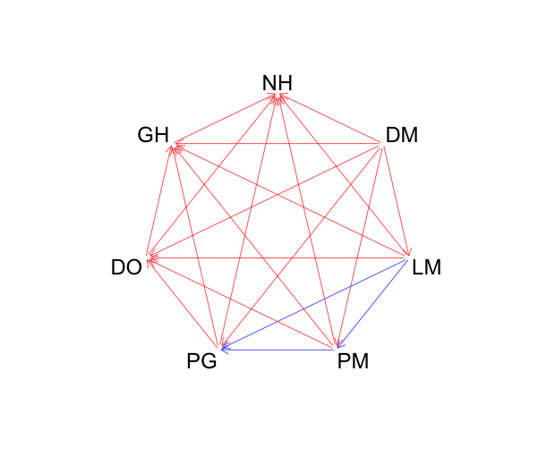
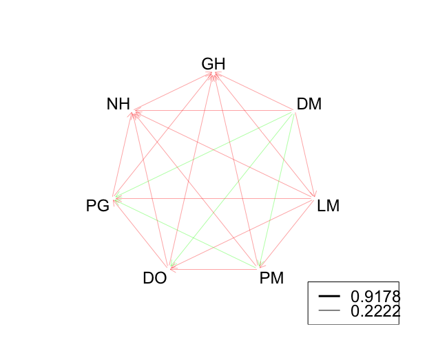
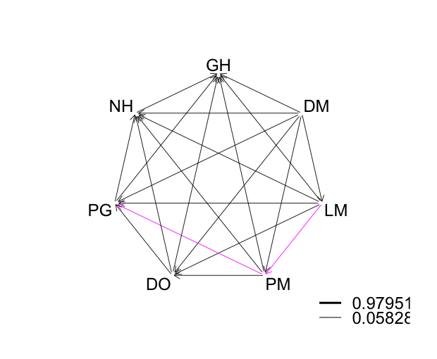

```{r}
library(dplyr)
library(diagram)
```

#Correlations

```{r}
cc<- correlations %>%
  select(-X)
diag(cc) <-0
Col <- cc
Col[] <- "red"
Col[cc>0.8] <- "blue" #the values greater than 0.8 will be blue, you can change this value ever than you want...
plotweb(cc, maxarrow = 3, arr.col = Col)
```





#Metepec corrrelations

```{r}
mc<- met_cor %>%
  select(-X)
diag(mc) <-0
Col <- mc
Col[] <- "red"
Col[mc>0.7] <- "green"
plotweb(mc, legend=T, maxarrow = 3, arr.col = Col) #legent=F shows the higher and lower value
```



#Banderas correlations

```{r}
bc<- ban_cor %>%
  select(-X)
diag(bc) <-0
Col <- bc
Col[] <- "black"
Col[bc>0.8] <- "magenta"
plotweb(bc, legend=T, maxarrow = 3, arr.col = Col, bty="n") #bty="n" removes the contour
```

