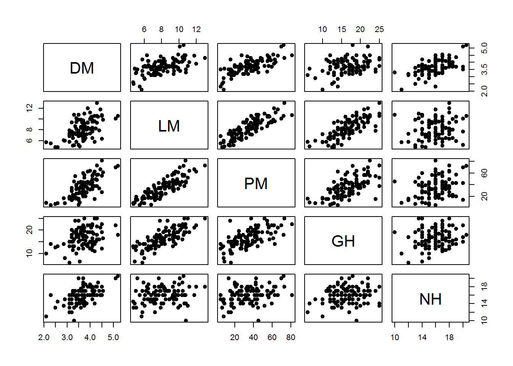
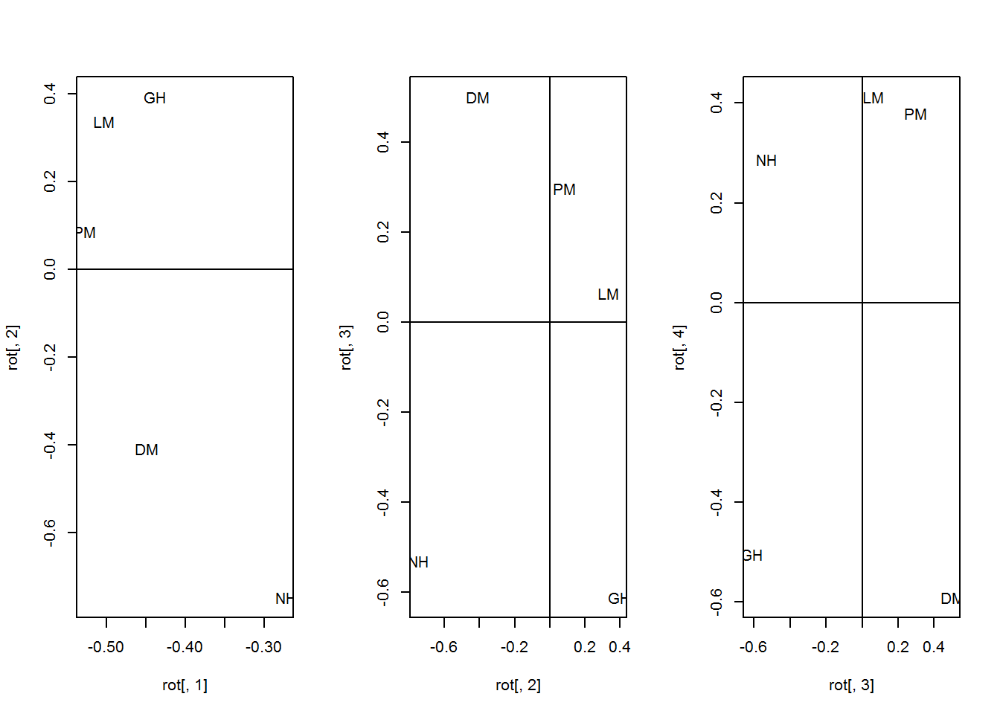

```{r}
library(dplyr)
data <- read.csv("~/data.csv")
```

#Arrange data
```{r}
medians<-data %>%
  filter(FG!="B73 x PT S1") %>%
  select(FG, LM, DM, NHG, PM, GPH) %>%
  group_by(FG) %>%
  summarise(DM= median(DM),
            LM= median(LM),
            PM= median(PM),
            GH= median(GPH),
            NH= median(NHG))
smedians<- medians %>%
  select(DM, LM, PM, GH, NH)
```

#Correlations
```{r}
round(cor(smedians)*10)
pairs(smedians, pch=19, col="black")
```


#PCA
```{r}
pc1<- prcomp(smedians, scale.=T)
rot<- pc1$r
x<- pc1$x
summary(pc1)
```

#Graph PCA
```{r}
round(rot*10)
par(mfrow = c(1, 3))
plot(rot[, 1], rot[, 2], pch = "")
abline(h = 0, v = 0)
text(rot[, 1], rot[, 2], label = rownames(rot))
plot(rot[, 2], rot[, 3], pch = "")
abline(h = 0, v = 0)
text(rot[, 2], rot[, 3], label = rownames(rot))
plot(rot[, 3], rot[, 4], pch = "")
abline(h = 0, v = 0)
text(rot[, 3], rot[, 4], label = rownames(rot))
```


