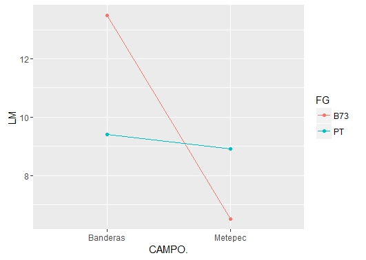

##Doing Reaction norms

```{r}
library("ggplot2")
library("dplyr")
data <- read.csv("~/resultados/datos.csv")
```

#Arrange data

```{r}
length <- data %>%
  filter(FG==c("B73", "PT")) %>%
  select(CAMPO., FG,LM) %>%
  group_by(CAMPO., FG) %>%
  summarise(LM= median(LM))
```

#Graphic
```{r}
ggplot(length, aes(CAMPO., LM, group=FG, colour=FG))+
  geom_line()+
  geom_point()
```

